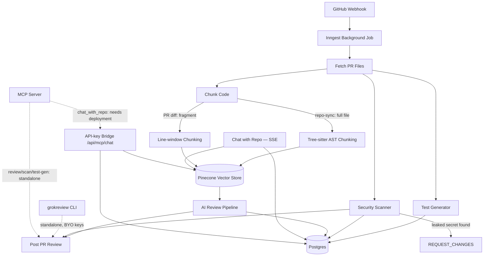

# Case Study: GrokReview / CodeLens AI

**An AI PR-review platform that reviews code like a senior engineer — across 6 LLM providers, with a security scanner, test generator, RAG chat over your codebase, and its own CLI and MCP server.**

This is the engineering writeup behind the project — what it does, the architecture decisions, and the two production-breaking bugs that came up while building it (and how they were actually diagnosed and fixed, not just papered over).

---

## The problem

Reviewing a pull request well takes real attention: understanding the change, checking for bugs and security issues, judging whether tests are missing, deciding if it's safe to merge. Most "AI code review" tools do one shallow pass — a single model reads a diff and writes some comments. That breaks down in three specific ways:

1. **Single-provider lock-in.** If your one AI provider is down, rate-limited, or wrong for the job, review stops.
2. **No security or test coverage signal.** A clean-sounding review can still ship a leaked API key or an untested edge case.
3. **No memory of the codebase.** The model only sees the diff — it can't answer "how does auth work here?" or reason about code the PR doesn't touch.

GrokReview (pitched at a hackathon as **CodeLens AI**) addresses all three: 6 interchangeable AI providers with automatic fallback, a security scanner that runs on every PR, an AI test generator, and a RAG-based chat interface over the whole indexed repository — plus a CLI and an MCP server so the same engine is usable from a terminal or from Claude Code/Cursor, not just a web dashboard.

## Architecture

**Stack:** Next.js 16 (App Router) · Prisma 7 / PostgreSQL · Inngest for background jobs · Pinecone for vector search · Vercel AI SDK across Groq, Mistral, HuggingFace, Gemini, OpenRouter, and local Ollama · `web-tree-sitter` for AST parsing · a published npm CLI (`grokreview`) · an MCP server (`grokreview-mcp`) built on `@modelcontextprotocol/sdk`.

## Design decisions worth calling out

**Fallback, not just multi-provider support.** Every review request tries the user's configured provider first and falls back to OpenRouter automatically on failure — the review pipeline doesn't go down because one upstream API is having a bad day.

**A security scanner that doesn't cry wolf.** Findings run through two layers: deterministic regex rules (hardcoded secrets, common vulnerability shapes) that cost nothing and never hallucinate, plus an AI-assisted pass for subtler issues. Only one category — leaked secrets — is allowed to escalate a review to `REQUEST_CHANGES` and actually block a merge, because it's the one category with near-zero false positives. Heuristic SQL-injection/XSS/SSRF patterns stay comment-only; a regex guessing wrong about a SQL query shouldn't be able to silently block someone's merge.

**AST-aware chunking only where it's trustworthy.** Full synced repository files get chunked along function/class/method boundaries via Tree-sitter — a semantically coherent chunk beats an arbitrary 80-line window for both review context and RAG retrieval quality. PR diffs deliberately *don't* get the same treatment: a diff hunk is a disconnected fragment of a file, not valid standalone syntax, so parsing it as if it were complete source would produce unreliable results. Line-windowing stays for diffs; AST chunking applies where the input is actually parseable.

**Chat that cites its sources.** The RAG chat endpoint returns file-path citations alongside every answer, so "how does auth work here?" comes back with the actual files it read, not just an assertion.

## Two bugs that would have shipped broken

**A dependency-version time bomb.** The AI-SDK provider packages (`@ai-sdk/groq`, `@ai-sdk/mistral`, etc.) had drifted to a newer language-model spec version than the pinned `ai` core package supported. It type-checked fine in one place only because that one call site was typed `any` — everywhere else, TypeScript caught it immediately as a hard type mismatch. Tracing it further, the actual `ai` package source confirmed it explicitly throws `UnsupportedModelVersionError` at runtime for exactly this mismatch. Not a hypothetical — this would have failed the first time a real user's PR triggered a review. Fixed by pinning every provider package to the last release still compatible with the installed `ai` version, verified by checking the resolved dependency tree directly rather than trusting semver ranges.

**A bundler quietly trying to reinterpret a data file as a module.** Adding Tree-sitter's WASM grammars broke the production build under Turbopack (Next.js 16's default bundler) — it saw a `require.resolve()` call resolving to a `.wasm` file and tried to treat it as an importable WebAssembly module rather than a plain asset to read bytes from. The fix was resolving each grammar package's `package.json` instead of the `.wasm` file directly (so the bundler's static analysis never sees a `.wasm`-suffixed target), combined with an explicit `outputFileTracingIncludes` entry in `next.config.ts` so the actual asset still ships in a serverless deployment. This was caught by actually running `next build` after the change — not just `tsc --noEmit`, which passed the whole time and would have shipped a build that broke in production.

Both were verified with real, executable evidence — a scratch script running the actual WASM parser before writing production code, and a real `next build` invocation, not just type-checking — rather than assumed to work.

## Outcome

- 6 AI providers with automatic fallback, plus fully local operation via Ollama
- A security scanner, test generator, code health dashboard, and RAG chat, all shipped on top of the existing review pipeline rather than as a rewrite
- A published CLI (`npm install -g grokreview`) and an MCP server (`grokreview-mcp`) exposing the same engine to terminals and to Claude Code/Cursor
- 30 unit tests covering the security rules, complexity analysis, and AST chunking (against the real WASM parser, not mocks)
- This branch alone: ~5,200 lines across 91 files, all passing `tsc`, `eslint`, `vitest`, and a real production `next build`

## What's next

GitLab/Bitbucket support, a pluggable vector store (Qdrant/Chroma alongside Pinecone), and folding the code-health complexity signal into PR review comments directly (surfacing "this PR touches a known hotspot file" inline).
