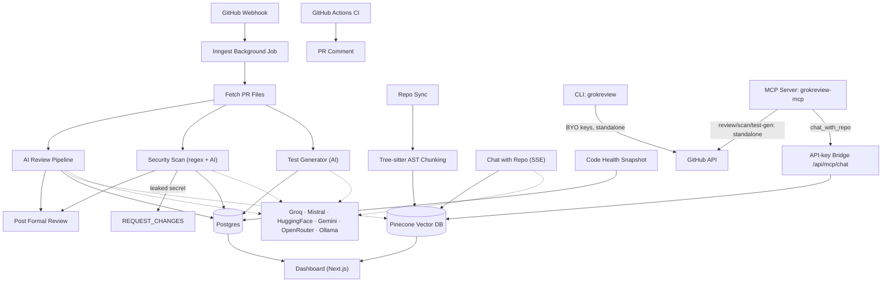

# 🚀 GrokReview

[](https://github.com/KunjShah95/grokreview/actions/workflows/ci.yml)
[](https://github.com/KunjShah95/grokreview/releases)
[](LICENSE)

> **AI-powered Pull Request reviews. Use any model, any provider, any workflow.**

GrokReview is a next-generation AI code review platform — CodeLens AI — that connects to your GitHub repositories and acts like a senior engineer on every pull request: explaining changes in plain English, catching bugs and security issues, generating unit tests, and answering questions about your codebase. It supports **6 AI providers** (Groq, Mistral, HuggingFace, Gemini, OpenRouter, Ollama), has a **streaming SSE review engine**, a **security scanner**, an **AI test generator**, **RAG chat over your repository**, a **code health dashboard**, **GitHub Actions CI integration**, an **analytics dashboard with heatmaps**, a **multi-model comparison tool**, a full-featured **CLI**, and an **MCP server** for use from Claude Code, Cursor, and other MCP clients.

📄 **[Read the full engineering case study](CASE_STUDY.md)** — architecture decisions, and two real production bugs found and fixed along the way.

---

## 🎯 What makes this different

Most "AI PR review" projects are a single model reading a diff. This one isn't:

- **No single point of failure** — 6 interchangeable providers with automatic fallback; a rate-limited or down provider doesn't stop reviews.
- **A security scanner that doesn't cry wolf** — deterministic secret detection (zero false positives) plus AI-assisted vulnerability heuristics, with only leaked secrets allowed to block a merge.
- **Real code understanding, not string matching** — Tree-sitter AST parsing chunks synced repos along function/class boundaries, so RAG chat and review context stay semantically coherent instead of arbitrary 80-line windows.
- **Usable from a terminal or an AI coding agent, not just a browser** — a published CLI (`grokreview`) and an MCP server (`grokreview-mcp`) expose the same engine to Claude Code, Cursor, and CI pipelines.

---

## ✨ Features

### 🤖 Multi-Provider AI
| Provider | Models | Free? |
|----------|--------|-------|
| **Groq** | Llama 3 70B/8B, Mixtral, Gemma 2, DeepSeek R1 | ✅ Free |
| **Mistral** | Mistral Large, Nemo, Codestral | ✅ Free tier |
| **HuggingFace** | Zephyr 7B, Mistral 7B, Llama 3.2 3B, DeepSeek R1 | ✅ Free |
| **Gemini** | Gemini 2.0 Flash, Flash Lite, 1.5 Pro | ✅ Free tier |
| **OpenRouter** | 200+ models (gateway) | ✅ Free tier |
| **Ollama** | Local models (llama3.2, codellama, phi3, qwen2.5-coder) | ✅ Free (local) |

### 🛡️ Security Scanner
Every PR is scanned automatically for hardcoded secrets (AWS/GitHub/Slack/Stripe keys, private keys, JWTs) via deterministic regex rules, plus an AI-assisted pass for SQL injection, XSS, SSRF, and insecure configuration. Findings show severity, category, and a suggested fix inline in the PR review.

### 🧪 AI Test Generator
Generates unit test scaffolds for a PR's changed source files, auto-detecting the framework (Vitest, pytest, Go `testing`, JUnit, RSpec) from file extensions. Copy the generated test straight into your branch.

### 💬 Chat with Repository (RAG)
Ask questions about a synced codebase in plain English — answers are grounded in your repo's indexed source with inline file citations, streamed token-by-token. Synced files are chunked along function/class/method boundaries (via Tree-sitter, for JS/TS/TSX/Python) rather than fixed-size line windows, so retrieved context stays semantically coherent.

### 📈 Code Health Dashboard
Tracks average estimated complexity, hotspot files, open security debt, and estimated test coverage on every repo sync, with a trend chart over time.

### 📊 Dashboard
- **Overview** — Real-time stats: total reviews, monthly usage, connected repos, plan status
- **Repositories** — Infinite-scroll repo list with search, visibility filter, sync status
- **Pull Requests** — Full review history with expandable reviews, status filters, search
- **Analytics** — Review charts (line/pie/bar), GitHub-style contribution **heatmap**, model usage
- **Usage** — Monthly progress bar, 6-month history, cost estimates, daily activity mini-chart
- **Monthly Leaderboard** — Top contributors ranking with medals, trends, and progress bars

### ⚡ Streaming Reviews
Real-time SSE streaming so you see reviews appear **token-by-token** as the AI generates them. Includes model selector, copy/export, and stop/cancel controls.

### 🎯 Multi-Model Comparison
Compare two AI models **side-by-side** on the same PR. See speed comparison, unique findings per model, common findings both agreed on, and full review panels with copy buttons. Quick pairs: "Speed vs Quality" (8B vs 70B) and "Code Specialists".

### 🔍 Webhook Event Log
Live feed of incoming GitHub webhooks for debugging. Filter by event type, expand payloads, auto-refresh.

### 🖥️ CLI Tool
```bash
npm install -g grokreview   # installs both `grokreview` and `pr-review` binaries

grokreview review owner/repo#42                 # Review any PR
grokreview review -p 42 -r owner/repo -m groq:llama3-70b  # Choose model
grokreview batch -r owner/repo                  # Batch review all open PRs
grokreview ci -p 42 -r owner/repo               # CI mode (exit code on failures)
grokreview models                               # List available models
grokreview models --local                       # Detect local Ollama models
grokreview scan owner/repo#42                   # Scan a PR for secrets & vulnerabilities
grokreview generate-tests owner/repo#42         # Generate unit tests for a PR
grokreview usage                                # Show usage stats & limits
grokreview config set GROQ_API_KEY xxx          # Set API key
grokreview config list                          # Show configuration
```

### 🔔 Integrations
- **Slack** — Review notifications to Slack channels
- **Discord** — Review notifications to Discord servers
- **GitHub Actions** — Run as a CI check on every PR
- **Custom Prompts** — 5 templates (Default, Security Audit, Performance Audit, Simple, Educational)

### 🛡️ Reliability
- **Error Boundaries** — Catch-all error UI with retry on every dashboard page
- **Review Caching** — Skips re-review if head SHA hasn't changed
- **Graceful Fallback** — Falls back to OpenRouter if primary model fails
- **Signature Verification** — Validates GitHub webhook signatures

### 💰 Billing
- Razorpay subscription integration
- 5 free reviews per month
- Pro plan for unlimited reviews
- Usage tracking and cost estimation

---

## 🚀 Quick Start

### 1. Clone & Install
```bash
git clone https://github.com/your-org/grokreview.git
cd grokreview
npm install
```

### 2. Set Up Environment
```bash
cp .env.example .env
# At minimum, set:
# DATABASE_URL=postgresql://...
# GITHUB_CLIENT_ID=...
# GITHUB_CLIENT_SECRET=...
# At least one AI provider key (see below)
```

### 3. Set Up Database
```bash
docker compose up -d           # Start PostgreSQL
npx prisma migrate dev         # Run migrations
```

### 4. Configure AI Provider
Pick one or more:
```bash
# Groq (fastest, recommended)
GROQ_API_KEY=gsk_...

# OR OpenRouter (fallback, 200+ models)
OPENROUTER_API_KEY=sk-or-...

# OR Mistral
MISTRAL_API_KEY=...

# OR HuggingFace (free tier)
HUGGINGFACE_API_KEY=hf_...

# OR Gemini (free tier, aistudio.google.com/apikey)
GEMINI_API_KEY=...

# OR Ollama (fully local)
# Just install Ollama and pull a model:
# ollama pull llama3.2
```

### 5. Start Development
```bash
npm run dev
# Open http://localhost:3000
```

### 6. Install GitHub App
1. Go to Settings → GitHub App in the dashboard
2. Click "Install GitHub App"
3. Select repositories to grant access
4. Open a PR — review appears automatically!

---

## 📦 CLI Tool Setup

```bash
cd cli
npm install
npm run build
npm link  # or: npm install -g .
```

Published to npm as [`grokreview`](https://www.npmjs.com/package/grokreview) — `npm install -g grokreview` gives you both the `grokreview` and `pr-review` binaries (identical, use whichever you prefer).

---

## 🔌 MCP Server

Expose AI review, security scanning, and test generation as MCP tools — usable from Claude Code, Cursor, or any
MCP-compatible client, without running the web app.

```bash
npm install -g grokreview-mcp
```

```json
{
  "mcpServers": {
    "grokreview": {
      "command": "grokreview-mcp",
      "env": { "GITHUB_TOKEN": "ghp_...", "GROQ_API_KEY": "gsk_..." }
    }
  }
}
```

Tools: `review_pr`, `scan_security`, `generate_tests`. See [`mcp/README.md`](mcp/README.md) for details.

---

## 🏗️ Architecture



### Key Technologies
- **Frontend**: Next.js 16 (App Router), React 19, shadcn/ui, Tailwind CSS v4
- **Backend**: Next.js API routes, Prisma 7 (PostgreSQL), Inngest (background jobs)
- **Auth**: BetterAuth with GitHub OAuth
- **AI**: Vercel AI SDK (Groq, Mistral, HuggingFace, Gemini, OpenRouter) + Ollama HTTP API
- **Vector DB**: Pinecone for code context and RAG chat
- **Code parsing**: `web-tree-sitter` — AST-aware chunking (JS/TS/TSX/Python) for synced repos
- **CLI**: Commander, Octokit, AI SDK
- **MCP**: `@modelcontextprotocol/sdk` — exposes review/security/test-gen/chat as tools

---

## 📁 Project Structure

```
├── app/                          # Next.js App Router
│   ├── (auth)/                   # Auth pages (sign-in)
│   ├── (protected)/dashboard/    # Dashboard pages
│   │   ├── page.tsx              # Overview
│   │   ├── analytics/            # Analytics + heatmap + leaderboard
│   │   ├── chat/                 # Chat with Repository (RAG)
│   │   ├── code-health/          # Code health dashboard
│   │   ├── github/               # GitHub App management
│   │   ├── pull-request/         # PR history (review, security, tests)
│   │   ├── repos/                # Repository list
│   │   ├── settings/             # Settings (profile, models, prompts, integrations)
│   │   ├── usage/                # Usage tracking
│   │   └── webhooks/             # Webhook event log
│   └── api/                      # API routes
│       ├── chat/[owner]/[repo]/  # RAG chat SSE endpoint
│       ├── code-health/[owner]/[repo]/ # Code health snapshot API
│       ├── github/               # GitHub webhook, callback, CI review
│       ├── reviews/stream/       # SSE streaming endpoint
│       ├── reviews/compare/      # Multi-model comparison endpoint
│       ├── security/scan/        # Manual security re-scan
│       ├── test-gen/generate/    # Manual test regeneration
│       └── webhooks/log/         # Webhook log API
├── components/                   # Shared UI components
│   └── ui/                       # shadcn/ui components
├── features/                     # Feature modules
│   ├── ai/                       # Multi-provider AI system
│   │   ├── providers/            # Provider adapters (Groq, Mistral, Gemini, etc.)
│   │   ├── registry.ts           # Provider registry
│   │   ├── streaming.ts          # SSE streaming support
│   │   └── types.ts              # AI model types
│   ├── analytics/                # Analytics, heatmap, leaderboard
│   ├── billing/                  # Subscription & usage
│   ├── chat/                     # Chat with Repository (RAG)
│   ├── code-health/              # Complexity/hotspot/security-debt snapshots
│   ├── dashboard/                # Dashboard shell, sidebar, nav
│   ├── github/                   # GitHub integration
│   ├── integrations/             # Slack/Discord webhooks
│   ├── prompts/                  # Custom review prompts
│   ├── reviews/                  # Review pipeline, history, comparison
│   ├── security/                 # Security scanner (secrets + vuln patterns + AI)
│   ├── settings/                 # Settings types, model config
│   ├── test-gen/                 # AI test generator
│   ├── usage/                    # Usage tracking
│   └── webhooks/                 # Webhook event log
├── cli/                          # CLI tool — published to npm as `grokreview` (bins: grokreview, pr-review)
│   └── src/commands/             # review, models, config, batch, ci, usage
├── mcp/                          # MCP server — published as grokreview-mcp
│   └── src/tools/                # review_pr, scan_security, generate_tests
├── prisma/                       # Database schema & migrations
└── lib/                          # Shared utilities
```

---

## 🧪 Running Tests

```bash
npm run lint       # ESLint
npx next build     # TypeScript check + build
```

---

## 🤝 Contributing

1. Fork the repository
2. Create a feature branch (`git checkout -b feature/amazing`)
3. Commit your changes (`git commit -m 'Add amazing feature'`)
4. Push to the branch (`git push origin feature/amazing`)
5. Open a Pull Request

---

## 📄 License

MIT License — see [LICENSE](LICENSE) for details.

---

## 🙏 Acknowledgments

- [Vercel AI SDK](https://sdk.vercel.ai/) for the unified AI interface
- [shadcn/ui](https://ui.shadcn.com/) for the beautiful component library
- [Inngest](https://www.inngest.com/) for background job processing
- [Pinecone](https://www.pinecone.io/) for vector storage
- [Phosphor Icons](https://phosphoricons.com/) for the icon set
